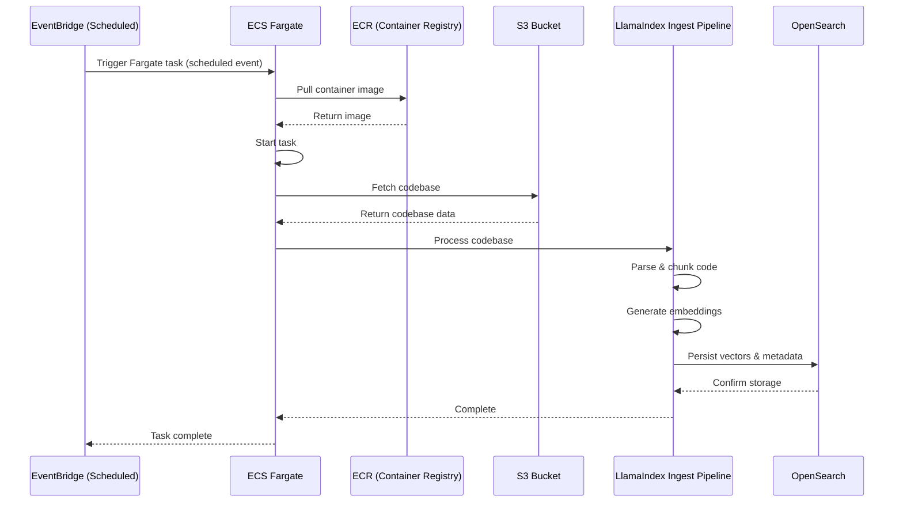

# Ingestion Pipeline Design

## Sequence Diagram

## Tech Stack

### Components

- **EventBridge**: Scheduled trigger for ECS Fargate task execution
- **ECS Fargate**: Serverless container execution for long-running ingestion jobs (no time limits)
- **ECR**: Container registry for storing Docker images
- **S3**: Storage for raw codebase data
- **LlamaIndex Ingest Pipeline**: Integration framework for code processing and embedding
- **AWS Managed OpenSearch**: Managed search service with hybrid search capabilities (vector + keyword)

### Key Features

- Automated scheduled ingestion
- Scalable serverless architecture without time constraints
- Containerized deployment for flexibility
- Hybrid search support (semantic + lexical)
- Managed infrastructure for ease of setup

