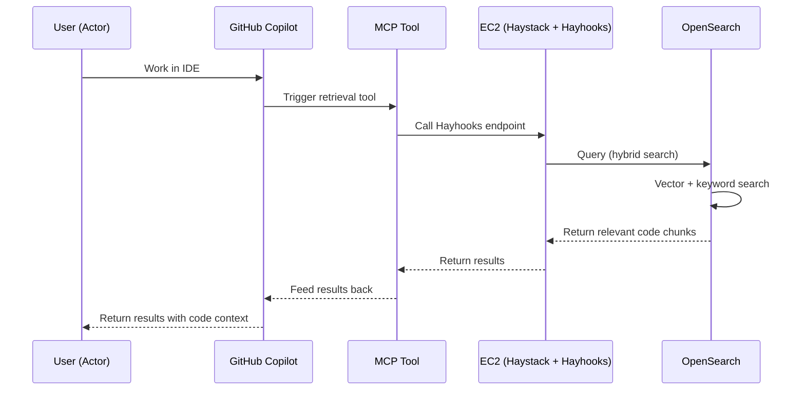

# Retrieval Pipeline Design

## Sequence Diagram

## Tech Stack

### Components

- **User**: Developer working in IDE
- **GitHub Copilot**: AI coding assistant with enhanced code context
- **MCP Tool**: Model Context Protocol tool for retrieval operations
- **EC2 (Haystack + Hayhooks)**: Hosted endpoint running Haystack retrieval pipeline with Hayhooks REST API
- **OpenSearch**: Vector database for hybrid search (semantic + lexical)

### Key Features

- Real-time code retrieval during development
- Hybrid search for accurate results
- Seamless integration with Copilot workflow
- Context-aware code suggestions
- Easy MCP integration via Hayhooks REST API endpoint on EC2

